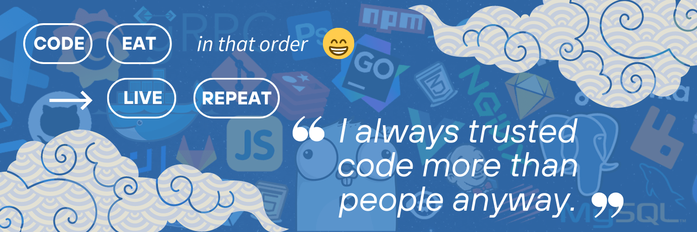

# 👋🏽 Hi everyone

My name is Daouda (Dave like DEV) 😉 I'm a fullstack developer with accomplished research and development skills and based on Dakar (Senegal).  
I possess certificates of various technologies on software development and have been working as a software developer for more than 5 years

- 🌐 I am also the founder of [Galsen Dev](https://www.galsendev.com/), a community of senegalese developer
- 💡 I love to turn complex problems into simple, beautiful and intuitive designs

## DEV STACK 🚀

**Programming Languages**

|||||||
|--|--|--|--|--|--|--|--|

**Libraries and Frameworks**

|||||||
|--|--|--|--|--|--|--|--|

|||||||
|--|--|--|--|--|--|--|--|

**Tools**

|||||||
|--|--|--|--|--|--|--|--|

|||||||
|--|--|--|--|--|--|--|--|

## SUPPORT ME ✅

  

